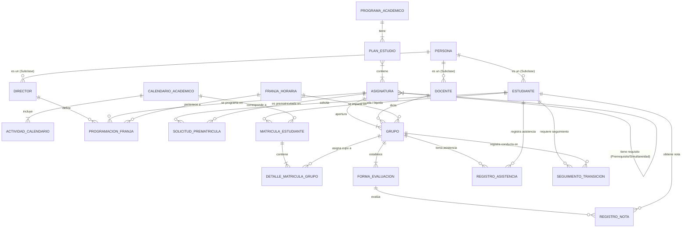

# Solución Examen Final — Punto 1: Modelado E-ER y Diccionario de Datos (Sistema UTP)

- **Asignatura:** Bases de Datos I (IS644) — Universidad Tecnológica de Pereira (UTP)
- **Unidad / Tema:** Unidad 3 (Diseño de Bases de Datos, Modelo E/R y E-ER Extendido)
- **Semanas Relacionadas:** Semanas 4, 5 y 6 según `syllabus.md`
- **Referencia Bibliográfica:** Connolly & Begg (4ª ed.), Capítulos 11, 12 y 13

---

## 1. Análisis de Requerimientos y Casos del Dominio

El caso de estudio describe la sistematización del **Registro de Notas y Matrícula de la UTP**, el cual abarca los siguientes hitos y reglas del proceso:

1. **Calendario Académico y Sesiones:** El Consejo Académico aprueba el calendario del periodo (actividades administrativas y académicas con sus fechas).
2. **Definición de Franjas Horarias:** Los Directores de Programa o Departamento programan las asignaturas en franjas horarias y definen el número máximo de grupos por franja.
3. **Pre-matrícula Inteligente:** 
   - Los estudiantes seleccionan asignaturas.
   - El sistema filtra únicamente las asignaturas válidas según el **Plan de Estudios** (cumplimiento de prerrequisitos y simultaneidades) y el **Reglamento Estudiantil**.
4. **Validación de Pago:** Al finalizar el periodo de pago de matrícula, se retira de la asignación a las personas que no cancelaron el valor correspondiente.
5. **Asignación de Franjas y Priorización:**
   - Asignación libre de cruces.
   - **Prioridad 1:** Estudiantes matriculados en bloque.
   - **Prioridad 2:** Orden descendente por créditos acumulados (mayor a menor).
   - **Trazabilidad:** Si una asignatura no es asignada, se registra explícitamente el `motivo_rechazo`.
6. **Formación de Grupos:** Creación secuencial de grupos (Grupo 1 se llena hasta el cupo máximo de la asignatura, luego Grupo 2, etc.).
7. **Asignación Docente y Ajustes:**
   - Publicación del horario en el portal estudiantil.
   - Directores asignan los docentes a cada grupo.
   - Apertura de periodo de ajustes (adición, cambio de grupo, retiro) y matrícula extemporánea.
8. **Evaluación, Asistencia y Seguimiento Especial:**
   - El docente define formas de evaluación, ponderaciones y fechas.
   - Registro de notas y asistencia por clase.
   - **Semestre de Transición:** Registro adicional obligatorio de notas de comportamiento y dedicación para estudiantes en estado de *Semestre de Transición*.
9. **Cancelación de Materias y Cierre Académico:**
   - Cancelación de asignaturas hasta la 8ª semana (múltiples) y 1 asignatura adicional hasta el último día de clases.
   - Cálculo final de promedios integrales, créditos aprobados/acumulados y recalificación del estado estudiantil (*Normal, Fuera, Fuera por un semestre, Prueba, Semestre de transición*).

---

## 2. Definición del Modelo Entidad-Relación Extendido (E-ER)

### 2.1 Jerarquía de Especialización (Subclases)
* **Superclase `Persona`**: Atributos comunes (`id_persona`, `num_identificacion`, `nombres`, `apellidos`, `email_institucional`).
  * **Subclase `Estudiante`**: `cod_estudiante`, `promedio_integral`, `creditos_acumulados`, `creditos_aprobados`, `estado`, `en_bloque`.
  * **Subclase `Docente`**: `cod_docente`, `titulo_academico`.
  * **Subclase `Director`**: `cod_director`, `departamento_id`.

### 2.2 Entidades de Estructura Académica
* **`Programa_Academico`**: `cod_programa` (PK), `nombre_programa`, `num_creditos_totales`.
* **`Plan_Estudio`**: `cod_plan` (PK), `version`, `fecha_aprobacion`.
* **`Asignatura`**: `cod_asignatura` (PK), `nombre_asignatura`, `creditos`, `cupo_maximo_grupo`.
* **`Requisito_Asignatura` (Relación Recursiva M:N)**: `cod_asignatura` (FK), `cod_requisito` (FK), `tipo_requisito` (*Prerrequisito* | *Simultaneidad*).

### 2.3 Entidades del Proceso Operativo
* **`Calendario_Academico`**: `id_calendario` (PK), `periodo`, `fecha_sesion_consejo`.
* **`Actividad_Calendario`**: `id_actividad` (PK), `nombre_actividad`, `fecha_inicio`, `fecha_fin`.
* **`Franja_Horaria`**: `id_franja` (PK), `dia_semana`, `hora_inicio`, `hora_fin`.
* **`Programacion_Franja`**: `id_programacion` (PK), `cod_asignatura` (FK), `id_franja` (FK), `max_grupos`.
* **`Solicitud_Prematricula`**: `id_prematricula` (PK), `cod_estudiante` (FK), `cod_asignatura` (FK), `estado_asignacion` (*Asignada* | *Rechazada*), `motivo_rechazo`.
* **`Matricula_Estudiante`**: `id_matricula` (PK), `cod_estudiante` (FK), `id_calendario` (FK), `estado_pago` (*Pagado* | *No Pagado* | *Extemporáneo*).
* **`Grupo`**: `id_grupo` (PK), `num_grupo`, `cod_asignatura` (FK), `cod_docente` (FK, nulo inicialmente), `id_franja` (FK), `cupo_actual`.
* **`Detalle_Matricula_Grupo`**: `id_detalle` (PK), `id_matricula` (FK), `id_grupo` (FK), `estado_materia` (*Matriculada* | *Cancelada_Semana8* | *Cancelada_Final*).

### 2.4 Entidades de Evaluación y Seguimiento
* **`Forma_Evaluacion`**: `id_evaluacion` (PK), `id_grupo` (FK), `descripcion`, `porcentaje`, `fecha_examen`.
* **`Registro_Nota`**: `id_registro_nota` (PK), `id_evaluacion` (FK), `cod_estudiante` (FK), `nota_obtenida`.
* **`Registro_Asistencia`**: `id_asistencia` (PK), `id_grupo` (FK), `cod_estudiante` (FK), `fecha_clase`, `asistio`.
* **`Seguimiento_Transicion`**: `id_seguimiento` (PK), `cod_estudiante` (FK), `id_grupo` (FK), `fecha`, `nota_comportamiento`, `nota_dedicacion`.

---

## 3. Diagrama E-ER (Excalidraw y Mermaid)

* **Archivo ejecutable Excalidraw:** [`modelo-er-utp.excalidraw`](diagrams/modelo-er-utp.excalidraw) *(Abrir en VS Code con la extensión Excalidraw)*

---

## 4. Diccionario de Datos Completo

### Tabla: `PERSONA`
| Atributo | Tipo de Dato | Nulo | Clave | Restricciones / Descripción |
| :--- | :--- | :---: | :---: | :--- |
| `id_persona` | VARCHAR(12) | NO | PK | Cédula o identificador único. |
| `num_identificacion` | VARCHAR(20) | NO | Unique | Documento de identidad. |
| `nombres` | VARCHAR(100) | NO | - | Nombres de la persona. |
| `apellidos` | VARCHAR(100) | NO | - | Apellidos de la persona. |
| `email_institucional`| VARCHAR(100) | NO | Unique | Correo institucional `@utp.edu.co`. |

### Tabla: `ESTUDIANTE`
| Atributo | Tipo de Dato | Nulo | Clave | Restricciones / Descripción |
| :--- | :--- | :---: | :---: | :--- |
| `cod_estudiante` | VARCHAR(12) | NO | PK, FK | Ref. `PERSONA.id_persona`. |
| `promedio_integral` | DECIMAL(3,2) | NO | - | Check: `0.00 <= promedio_integral <= 5.00`. |
| `creditos_acumulados` | INT | NO | - | Check: `creditos_acumulados >= 0`. |
| `creditos_aprobados` | INT | NO | - | Check: `creditos_aprobados >= 0`. |
| `estado` | VARCHAR(30) | NO | - | Check: (`'Normal'`, `'Fuera'`, `'Fuera un semestre'`, `'Prueba'`, `'Semestre de transición'`). |
| `en_bloque` | BOOLEAN | NO | - | Indicar si cursa materias en bloque. |

### Tabla: `ASIGNATURA`
| Atributo | Tipo de Dato | Nulo | Clave | Restricciones / Descripción |
| :--- | :--- | :---: | :---: | :--- |
| `cod_asignatura` | VARCHAR(10) | NO | PK | Código oficial (ej. 'IS644'). |
| `nombre_asignatura` | VARCHAR(100) | NO | - | Nombre de la asignatura. |
| `creditos` | INT | NO | - | Check: `creditos > 0`. |
| `cupo_maximo_grupo` | INT | NO | - | Capacidad límite definida por asignatura. |

### Tabla: `REQUISITO_ASIGNATURA`
| Atributo | Tipo de Dato | Nulo | Clave | Restricciones / Descripción |
| :--- | :--- | :---: | :---: | :--- |
| `cod_asignatura` | VARCHAR(10) | NO | PK, FK | Materia que requiere el requisito (Ref. `ASIGNATURA`). |
| `cod_requisito` | VARCHAR(10) | NO | PK, FK | Materia prerrequisito/simultánea (Ref. `ASIGNATURA`). |
| `tipo_requisito` | VARCHAR(20) | NO | - | Check: (`'Prerrequisito'`, `'Simultaneidad'`). |

### Tabla: `SOLICITUD_PREMATRICULA`
| Atributo | Tipo de Dato | Nulo | Clave | Restricciones / Descripción |
| :--- | :--- | :---: | :---: | :--- |
| `id_prematricula` | INT AUTO_INC | NO | PK | ID secuencial. |
| `cod_estudiante` | VARCHAR(12) | NO | FK | Ref. `ESTUDIANTE`. |
| `cod_asignatura` | VARCHAR(10) | NO | FK | Ref. `ASIGNATURA`. |
| `estado_asignacion`| VARCHAR(20) | NO | - | Check: (`'Asignada'`, `'Rechazada'`). |
| `motivo_rechazo` | VARCHAR(255) | SÍ | - | Detalle en caso de no asignación (cruce, cupo). |

### Tabla: `GRUPO`
| Atributo | Tipo de Dato | Nulo | Clave | Restricciones / Descripción |
| :--- | :--- | :---: | :---: | :--- |
| `id_grupo` | INT AUTO_INC | NO | PK | ID del grupo. |
| `num_grupo` | INT | NO | - | Número secuencial (1, 2, 3...). |
| `cod_asignatura` | VARCHAR(10) | NO | FK | Ref. `ASIGNATURA`. |
| `cod_docente` | VARCHAR(12) | SÍ | FK | Ref. `DOCENTE` (Se asigna tras pre-matrícula). |
| `id_franja` | INT | NO | FK | Ref. `FRANJA_HORARIA`. |
| `cupo_actual` | INT | NO | - | Estudiantes asignados hasta el momento. |

### Tabla: `DETALLE_MATRICULA_GRUPO`
| Atributo | Tipo de Dato | Nulo | Clave | Restricciones / Descripción |
| :--- | :--- | :---: | :---: | :--- |
| `id_detalle` | INT AUTO_INC | NO | PK | ID de detalle. |
| `id_matricula` | INT | NO | FK | Ref. `MATRICULA_ESTUDIANTE`. |
| `id_grupo` | INT | NO | FK | Ref. `GRUPO`. |
| `estado_materia` | VARCHAR(25) | NO | - | Check: (`'Matriculada'`, `'Cancelada Semana 8'`, `'Cancelada Final'`). |

### Tabla: `SEGUIMIENTO_TRANSICION`
| Atributo | Tipo de Dato | Nulo | Clave | Restricciones / Descripción |
| :--- | :--- | :---: | :---: | :--- |
| `id_seguimiento` | INT AUTO_INC | NO | PK | Registro de seguimiento especial. |
| `cod_estudiante` | VARCHAR(12) | NO | FK | Ref. `ESTUDIANTE`. |
| `id_grupo` | INT | NO | FK | Ref. `GRUPO`. |
| `fecha` | DATE | NO | - | Fecha de evaluación de conducta. |
| `nota_comportamiento`| DECIMAL(3,2)| NO | - | Check: `0.00 <= nota_comportamiento <= 5.00`. |
| `nota_dedicacion` | DECIMAL(3,2)| NO | - | Check: `0.00 <= nota_dedicacion <= 5.00`. |

---

## 5. Preguntas de Repaso y Verificación para Examen

1. **¿Por qué `Persona` se modela como Superclase?**
   * *Respuesta:* Porque comparte atributos básicos (cédula, nombres, correo) entre Estudiantes, Docentes y Directores, evitando duplicidad y permitiendo especialización disjunta.
2. **¿Cómo garantiza la base de datos la regla de priorización de cupos?**
   * *Respuesta:* Mediante una consulta de ordenamiento previa a la asignación de grupos: `ORDER BY en_bloque DESC, creditos_acumulados DESC`.
3. **¿Cómo se modelan los prerrequisitos y simultaneidades?**
   * *Respuesta:* Con una relación recursiva M:N en la entidad `ASIGNATURA` resuelta mediante la tabla asociativa `REQUISITO_ASIGNATURA` con un campo discriminador `tipo_requisito`.
