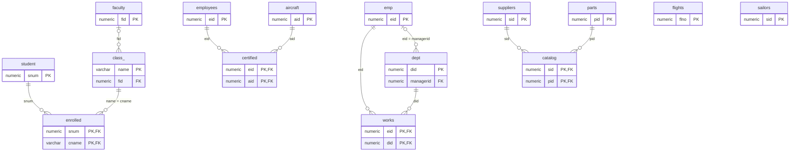

# Taller JOINs — Script dbbook 2026-2

Motor usado: **PostgreSQL** (Supabase, SQL Editor).

- Script de creación y datos corregido: [taller-joins.sql](taller-joins.sql)
- Consultas del punto 6: [taller-joins-solucion.sql](taller-joins-solucion.sql)

> En cada punto, pegar la captura de la consulta y de su salida donde dice **[Captura]**.

---

## 1. Ejecución del script (solo creación de tablas)

El script original está escrito para **Oracle** (SQL*Plus). En PostgreSQL falló con los errores de abajo; esta tabla explica cómo se corrigió cada uno.

| Error / instrucción original | Causa | Corrección |
|---|---|---|
| `drop table student cascade constraints;` → *syntax error at or near "constraints"* | `CASCADE CONSTRAINTS` es exclusivo de Oracle. | `drop table if exists student cascade;` — `IF EXISTS` evita el error si la tabla aún no existe y `CASCADE` borra también las FK que dependen de ella. |
| `number(9,0)` → *type "number" does not exist* | `NUMBER` es un tipo de Oracle. | `numeric(9,0)` (mismo significado: precisión, escala). |
| `varchar2(30)` → *type "varchar2" does not exist* | `VARCHAR2` es de Oracle. | `varchar(30)`. |
| `departs date`, `arrives date` | En Oracle `DATE` guarda fecha **y hora**; en PostgreSQL `date` solo la fecha (se perdería la hora del vuelo). | `timestamp`. |
| `to_date('12/04/2005 09:30','DD/MM/RRRR HH24:MI')` | PostgreSQL no reconoce el formato `RRRR`, y `to_date` descarta la hora. | `to_timestamp('12/04/2005 09:30','DD/MM/YYYY HH24:MI')`. |
| `quit;` | Comando de SQL*Plus, no es SQL. | Eliminado. |
| `COMMIT;` suelto | En PostgreSQL da aviso *there is no transaction in progress*. | Todo el script va entre `begin; … commit;`: si algo falla, no queda nada a medias. |

`references faculty` (sin indicar la columna) sí funciona en PostgreSQL: apunta a la llave primaria de la tabla.

**[Captura]** ejecución del bloque `drop` + `create table` sin errores.

---

## 2. Diagrama de llaves primarias y foráneas

> En el diagrama la tabla `class` aparece como `class_` porque `class` es palabra reservada de Mermaid.

Observaciones del análisis:
- `enrolled`, `works`, `certified` y `catalog` son **tablas intermedias** de relaciones muchos a muchos: su PK es compuesta y cada parte es FK.
- `class.fid` y `dept.managerid` son FK que **aceptan nulos** (una clase puede no tener profesor, p. ej. *Artificial Intelligence*).
- `flights` y `sailors` no tienen relaciones. `faculty.deptid` parece referenciar un departamento, pero **no** está declarado como FK (y sus valores 11, 12, 20… no existen en `dept`).
- `emp` y `employees` son tablas distintas aunque compartan algunos `eid`.

---

## 3. Diccionario de datos

**student** — estudiantes
| Campo | Tipo | Nulo | Llave | Descripción |
|---|---|---|---|---|
| snum | numeric(9,0) | No | PK | Número del estudiante |
| sname | varchar(30) | Sí | | Nombre |
| major | varchar(25) | Sí | | Carrera |
| standing | varchar(2) | Sí | | Nivel: FR, SO, JR, SR (1.º a 4.º año) |
| age | numeric(3,0) | Sí | | Edad |

**faculty** — profesores
| Campo | Tipo | Nulo | Llave | Descripción |
|---|---|---|---|---|
| fid | numeric(9,0) | No | PK | Identificador del profesor |
| fname | varchar(30) | Sí | | Nombre |
| deptid | numeric(2,0) | Sí | | Código del departamento (sin FK) |

**class** — cursos
| Campo | Tipo | Nulo | Llave | Descripción |
|---|---|---|---|---|
| name | varchar(40) | No | PK | Nombre del curso |
| meets_at | varchar(20) | Sí | | Días y hora (p. ej. MWF 10) |
| room | varchar(10) | Sí | | Salón |
| fid | numeric(9,0) | Sí | FK → faculty | Profesor que lo dicta |

**enrolled** — inscripciones
| Campo | Tipo | Nulo | Llave | Descripción |
|---|---|---|---|---|
| snum | numeric(9,0) | No | PK, FK → student | Estudiante |
| cname | varchar(40) | No | PK, FK → class(name) | Curso |

**emp** — empleados de la empresa
| Campo | Tipo | Nulo | Llave | Descripción |
|---|---|---|---|---|
| eid | numeric(9,0) | No | PK | Identificador |
| ename | varchar(30) | Sí | | Nombre |
| age | numeric(3,0) | Sí | | Edad |
| salary | numeric(10,2) | Sí | | Salario |

**dept** — departamentos
| Campo | Tipo | Nulo | Llave | Descripción |
|---|---|---|---|---|
| did | numeric(2,0) | No | PK | Identificador |
| dname | varchar(20) | Sí | | Nombre |
| budget | numeric(10,2) | Sí | | Presupuesto |
| managerid | numeric(9,0) | Sí | FK → emp(eid) | Gerente |

**works** — asignación de empleados a departamentos
| Campo | Tipo | Nulo | Llave | Descripción |
|---|---|---|---|---|
| eid | numeric(9,0) | No | PK, FK → emp | Empleado |
| did | numeric(2,0) | No | PK, FK → dept | Departamento |
| pct_time | numeric(3,0) | Sí | | % de su tiempo en ese departamento |

**flights** — vuelos
| Campo | Tipo | Nulo | Llave | Descripción |
|---|---|---|---|---|
| flno | numeric(4,0) | No | PK | Número de vuelo |
| origin | varchar(20) | Sí | | Ciudad de origen |
| destination | varchar(20) | Sí | | Ciudad de destino |
| distance | numeric(6,0) | Sí | | Distancia en millas |
| departs | timestamp | Sí | | Salida |
| arrives | timestamp | Sí | | Llegada |
| price | numeric(7,2) | Sí | | Precio |

**aircraft** — aviones
| Campo | Tipo | Nulo | Llave | Descripción |
|---|---|---|---|---|
| aid | numeric(9,0) | No | PK | Identificador |
| aname | varchar(30) | Sí | | Modelo |
| cruisingrange | numeric(6,0) | Sí | | Autonomía en millas |

**employees** — personal de la aerolínea (pilotos y otros)
| Campo | Tipo | Nulo | Llave | Descripción |
|---|---|---|---|---|
| eid | numeric(9,0) | No | PK | Identificador |
| ename | varchar(30) | Sí | | Nombre |
| salary | numeric(10,2) | Sí | | Salario |

**certified** — certificaciones de pilotos
| Campo | Tipo | Nulo | Llave | Descripción |
|---|---|---|---|---|
| eid | numeric(9,0) | No | PK, FK → employees | Empleado certificado |
| aid | numeric(9,0) | No | PK, FK → aircraft | Avión que puede operar |

**suppliers** — proveedores
| Campo | Tipo | Nulo | Llave | Descripción |
|---|---|---|---|---|
| sid | numeric(9,0) | No | PK | Identificador |
| sname | varchar(30) | Sí | | Nombre |
| address | varchar(40) | Sí | | Dirección |

**parts** — partes
| Campo | Tipo | Nulo | Llave | Descripción |
|---|---|---|---|---|
| pid | numeric(9,0) | No | PK | Identificador |
| pname | varchar(40) | Sí | | Nombre |
| color | varchar(15) | Sí | | Color |

**catalog** — qué parte vende cada proveedor
| Campo | Tipo | Nulo | Llave | Descripción |
|---|---|---|---|---|
| sid | numeric(9,0) | No | PK, FK → suppliers | Proveedor |
| pid | numeric(9,0) | No | PK, FK → parts | Parte |
| cost | numeric(10,2) | Sí | | Precio de ese proveedor |

**sailors** — marineros
| Campo | Tipo | Nulo | Llave | Descripción |
|---|---|---|---|---|
| sid | numeric(9,0) | No | PK | Identificador |
| sname | varchar(30) | Sí | | Nombre |
| rating | numeric(2,0) | Sí | | Calificación |
| age | numeric(4,1) | Sí | | Edad |

**flight_aircraft** — (creada en 6c) avión usado en cada vuelo
| Campo | Tipo | Nulo | Llave | Descripción |
|---|---|---|---|---|
| flno | numeric(4,0) | No | PK, FK → flights | Vuelo |
| aid | numeric(9,0) | No | FK → aircraft | Avión |

Campos agregados en 6d: `aircraft.capacity` (numeric(4,0), asientos), `aircraft.brand` (varchar(30), fabricante), `aircraft.company` (varchar(40), aerolínea dueña), `aircraft.aircraft_type` (varchar(20)), `flights.passengers` (numeric(4,0), pasajeros transportados).

---

## 4. Modelos independientes

El script tiene cinco bases de datos pequeñas que no se relacionan entre sí:

1. **Universidad** (`student`, `faculty`, `class`, `enrolled`): registra qué estudiantes están inscritos en qué cursos, quién dicta cada curso y dónde y cuándo se dicta. Responde preguntas como «¿quiénes ven Operating System Design?» o «¿qué cursos dicta un profesor?».
2. **Empresa** (`emp`, `dept`, `works`): empleados, departamentos y el porcentaje de tiempo que cada empleado trabaja en cada departamento (puede repartirse entre varios); cada departamento tiene un gerente. Sirve para nómina, presupuestos y para ver la carga de trabajo.
3. **Aerolínea** (`flights`, `aircraft`, `employees`, `certified`): vuelos con rutas, horarios y precios; aviones con su autonomía; y qué empleados (pilotos) están certificados para operar qué aviones. Responde, por ejemplo, qué pilotos pueden volar una ruta según la autonomía del avión.
4. **Proveedores y partes** (`suppliers`, `parts`, `catalog`): qué proveedor vende cada parte y a qué precio. Sirve para comparar precios y buscar quién suministra una parte.
5. **Marineros** (`sailors`): una sola tabla, sin relaciones; es el ejemplo clásico del libro para practicar consultas simples (en el libro va con `boats` y `reserves`, que aquí no están).

---

## 5. Inserción de registros

Se ejecutan todos los `insert` de [taller-joins.sql](taller-joins.sql). Filas cargadas:

| Tabla | Filas | Tabla | Filas | Tabla | Filas |
|---|---|---|---|---|---|
| student | 24 | dept | 7 | certified | 69 |
| faculty | 15 | works | 61 | suppliers | 4 |
| class | 22 | flights | 18 | parts | 9 |
| enrolled | 16 | aircraft | 16 | catalog | 17 |
| emp | 59 | employees | 31 | sailors | 4 |

**[Captura]** de los inserts y de un `select count(*)` por tabla.

---

## 6. Consultas

El SQL completo está en [taller-joins-solucion.sql](taller-joins-solucion.sql); ejecutarlo **en orden** (c → d → e, y las vistas de l antes de g).

| Punto | Qué se hace | Resultado esperado |
|---|---|---|
| a | `catalog` ⋈ `suppliers` ⋈ `parts` | 17 filas |
| b | `certified` ⋈ `employees` ⋈ `aircraft` | 69 filas |
| c | `create table flight_aircraft` + 10 inserts (aviones con autonomía suficiente para la distancia) | 10 filas |
| d | `alter table … add column` en aircraft y flights; `update` con `case` y con `update … from (values …)` | 16 aviones y 18 vuelos con datos nuevos |
| e | `alter table flight_aircraft add constraint … foreign key` | 2 FK visibles en `pg_constraint` |
| f | vista `v_inscritos_por_curso`, ordenada por curso (grupo) y estudiante | 16 filas |
| g | primero se borran las filas de `catalog` de las partes rojas (FK) y luego las partes | `v_partes_rojas`: 7 filas antes, 0 después |
| h | `update emp set age = 30 where ename = 'Daniel Evans'` | edad 25 → 30 |
| i | Lisa Walker está en `student`, `emp` y `employees`: se borran primero sus filas en `enrolled`, `works` y `certified` | 3 registros eliminados |
| j | `select` con `case` (vista `v_salario_incrementado`), sin modificar datos | 58 filas |
| k | `update emp set salary = salary * case … end` | 58 salarios actualizados |
| l | vistas `v_inscritos_por_curso` (f), `v_partes_rojas` (g), `v_salario_incrementado` (j) | — |
| m | `group by` avión + `having` = máximo | Boeing 747-400, 9 795 millas |
| n | `group by origin, destination` + `having` = máximo | Los Angeles → Honolulu, 660 pasajeros |

Nota sobre j/k: el enunciado dice «menor de 20», «entre 21 y 51» y «los demás». Una persona de **exactamente 20 años** no es menor de 20 ni está entre 21 y 51, así que cae en «los demás» (6 %). Así se aplicó, literal al enunciado (afecta a David Anderson y Louis Jenkins).

**[Captura]** de cada consulta y su salida.

---

## Investigación de comandos

| Comando | Para qué sirve | Ejemplo en el taller |
|---|---|---|
| `CREATE TABLE` | Crea una tabla con sus columnas, tipos y restricciones. | Todas las tablas; `flight_aircraft` (6c). |
| `PRIMARY KEY` | Identifica cada fila: valores únicos y no nulos. Puede ser compuesta. | `primary key(snum, cname)` en `enrolled`. |
| `FOREIGN KEY … REFERENCES` | Obliga a que el valor exista en la otra tabla (integridad referencial). Impide borrar el padre si hay hijos. | `foreign key(fid) references faculty`; por eso en g e i se borran primero los hijos. |
| `DROP TABLE IF EXISTS … CASCADE` | Borra la tabla; `IF EXISTS` evita error si no existe; `CASCADE` borra también objetos dependientes (FK, vistas). | Inicio del script. |
| `NUMERIC(p,s)` | Número exacto: `p` dígitos en total, `s` decimales. `numeric(10,2)` admite hasta 99 999 999.99. | Salarios, precios. |
| `VARCHAR(n)` | Texto de longitud variable, máximo `n` caracteres. | Nombres. |
| `TIMESTAMP` / `TO_TIMESTAMP(texto, formato)` | Fecha y hora; la función convierte un texto según un patrón (`DD/MM/YYYY HH24:MI`). | `departs`, `arrives`. |
| `BEGIN` / `COMMIT` | Agrupan sentencias en una transacción: se guardan todas o ninguna (`ROLLBACK` deshace). | Script, puntos g e i. |
| `INSERT INTO … VALUES` | Agrega filas; se pueden insertar varias separadas por coma. | 6c. |
| `SELECT … FROM … WHERE … ORDER BY` | Consulta datos, filtra filas y ordena. | Todos. |
| `INNER JOIN … ON` (`JOIN`) | Combina filas de dos tablas que cumplen la condición; las que no tienen pareja no aparecen. | a, b, f. |
| `LEFT JOIN` | Como `JOIN`, pero conserva todas las filas de la tabla izquierda aunque no tengan pareja (las columnas de la derecha quedan en `NULL`). | Profesor en f; proveedor en `v_partes_rojas`. |
| Alias (`AS`, `catalog c`) | Nombre corto para una tabla o columna. | Todos. |
| `ALTER TABLE … ADD COLUMN` | Agrega columnas a una tabla existente sin recrearla; las filas existentes quedan con `NULL`. | 6d. |
| `ALTER TABLE … ADD CONSTRAINT … FOREIGN KEY` | Agrega una FK después de creada la tabla; falla si algún dato no cumple. | 6e. |
| `UPDATE … SET … WHERE` | Modifica filas; sin `WHERE` cambia todas. | h, k. |
| `UPDATE … FROM (VALUES …)` | Actualiza usando otra tabla o lista de valores unida por una condición (extensión de PostgreSQL). | Pasajeros en 6d. |
| `DELETE FROM … WHERE` | Borra filas; sin `WHERE` borra todas. | g, i. |
| Subconsulta `IN (SELECT …)` | Usa el resultado de una consulta como lista de valores. | g, i. |
| `CASE WHEN … THEN … ELSE … END` | Condicional dentro de SQL; devuelve el valor de la primera condición verdadera. | d, j, k. |
| `BETWEEN a AND b` | Rango **inclusivo** (`>= a and <= b`). | j, k. |
| `ROUND(x, n)` | Redondea a `n` decimales. | j, k. |
| `CREATE VIEW … AS SELECT` | Guarda una consulta con nombre; se consulta como una tabla y siempre muestra datos actuales. | l. |
| `UNION ALL` | Une los resultados de varias consultas con las mismas columnas (sin quitar duplicados). | Búsqueda de Lisa Walker en i. |
| `GROUP BY` / `SUM` / `MAX` | Agrupa filas y calcula un valor por grupo. | m, n. |
| `HAVING` | Filtra **grupos** (el `WHERE` filtra filas antes de agrupar). | m, n. |
| `pg_constraint`, `pg_get_constraintdef` | Catálogo del sistema de PostgreSQL con las restricciones de cada tabla. | Verificación de 6e. |
