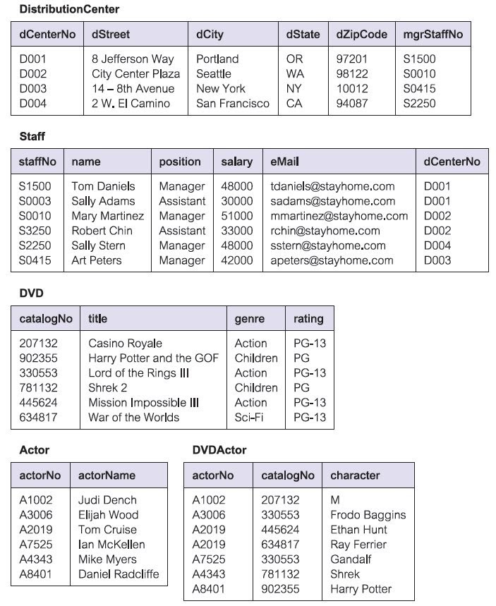
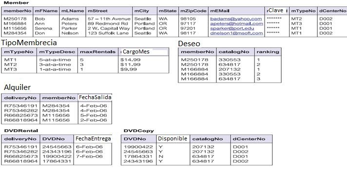

# UNIVERSIDAD TECNOLÓGICA DE PEREIRA

**Programa:** Ingeniería en Sistemas y Computación
**Asignatura:** Bases de Datos (IS644 Gr 100)
**Evaluación:** Examen Final
**Fecha:** 2021/07/12

---

## 1. Modelado ER y/o E-ER con diccionario de datos (2 Ptos.)

Para el siguiente ejercicio, realice el modelado ER y-o E-ER con diccionario de datos.

La UTP desea sistematizar el proceso registro de notas. El calendario académico define las actividades académicas y administrativas que se realizarán en un período académico determinado. Este es aprobado por el consejo académico en una de sus sesiones.

En el calendario, existe una actividad en la cual, antes de terminar cada semestre, los directores de programas o departamentos definen las franjas horarias para cada asignatura y el número máximo de grupos que se pueden dictar por franja. Otra actividad, es la de pre matricula de asignaturas, la cual realizan los estudiantes con base en las franjas y asignaturas programadas y para ello, se debe activar en el portal estudiantil la opción de pre matricula.

Cada estudiante selecciona las asignaturas que desea tomar pero el sistema debe mostrar solo las asignaturas que puede tomar basado en el plan de estudios para su programa y el reglamento estudiantil. El plan de estudios está formado por un conjunto de asignaturas y los requisitos y simultaneidades entre materias. El reglamento estudiantil define las reglas que deben que cumplir los estudiantes, directores y docentes respecto a lo académico.

Una vez que los estudiantes han cancelado el valor de la matricula (otra actividad del calendario), se procede a retirar las personas que no cancelaron matricula (a dichas personas, no se les genera horario con las asignaturas que seleccionaron).

El sistema asigna a cada estudiante una franja de horario para cada asignatura seleccionada verificando que no existan cruces y cumplan con el plan de estudios. Asignando primero los estudiantes que se encuentren en bloque y luego los estudiantes que tengan mayor número de créditos acumulados hasta los que tengan menor número. Para cada asignatura que no sea asignada, se debe registrar el motivo por el cual no pudo matricular.

Luego, se crean los grupos con base en el número de personas que solicitaron la asignatura y el número máximo de grupo por franja de la siguiente forma: en el grupo 1, quedan primeros que llenen el grupo (un valor máximo de estudiantes definido por cada asignatura), el grupo 2 tendrá los siguientes estudiantes hasta llenar el grupo y así sucesivamente.

Una vez termina este proceso, se activa la opción de ver horario de clases en el portal estudiantil y cada director de programa o departamento debe definir los docentes que dictaran cada una de las asignaturas. Como los estudiantes pueden ver el resultado de su pre matricula, estos pueden hacer los ajustes necesarios en las fechas señaladas (adicionando, cambiando de grupo o retirando asignaturas). En estas fechas, se puede realizar la matricula extemporánea (cancelación del dinero de la matrícula, posterior a la fecha del primer pago).

Cada docente debe definir la forma de evaluación de cada asignatura y las fechas en las efectuara los exámenes. Además de registrar las respectivas notas, la asistencia a cada clase y las notas de comportamiento y dedicación de aquellos estudiantes que se encuentran en estado de semestre de transición.

Los estudiantes pueden cancelar asignaturas hasta la octava semana y una asignatura después de esta fecha y hasta el último día de clase. Una vez registradas todas los notas por parte del docente, se debe registrar el promedio integral del semestre, los créditos acumulados, créditos aprobados y el estado (normal, fuera, fuera por un semestre, prueba y semestre de transición).

---

## 2. Consultas sobre la base de datos de películas, actores y alquileres

Con base en el esquema de la base de datos (películas, actores, alquileres, miembros y empleados), responda:

a. Listar las películas en DVD con sus actores y por cada actor el personaje (character) que interpreta.

b. ¿Cuáles son las películas que se encuentran alquiladas y cuales no se ha devuelto y quien las alquilo?

c. ¿Cuánto gana la empresa al mes?

d. Por principios de habeas data el cliente (member) Serena Parker solicito por escrito que toda su información fuera eliminada. Realizar este proceso.

e. Se le va a subir el sueldo a todos empleados bajo la siguiente condición: el 2% a todos las personas que ganan más que sueldo promedio, 3% al que ganan menos que el promedio. Actualizar la tabla respectiva bajo la condición dada.

---

## 3. Tabla Préstamo

| CodLibro | Titulo          | Autor                      | Editorial  | NombreLector          | FechaDev   |
|----------|-----------------|----------------------------|------------|-----------------------|------------|
| 1001     | Variable compleja | Murray Spiegel            | McGraw Hill | Pérez Gómez, Juan     | 15/04/2005 |
| 1004     | Visual Basic 5  | E. Petroustsos             | Anaya      | Ríos Terán, Ana       | 17/04/2005 |
| 1005     | Estadística     | Murray Spiegel             | McGraw Hill | Roca, René            | 16/04/2005 |
| 1006     | Oracle University | Nancy Greenberg y Priya Nathan | Oracle Corp. | García Roque, Luis | 20/04/2005 |
| 1007     | Clipper 5.01    | Ramalho                    | McGraw Hill | Pérez Gómez, Juan     | 18/04/2005 |