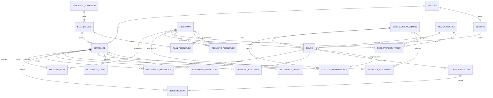

# Diseño de la base de datos — Punto 1: Registro de notas UTP

- **Punto del examen:** 1 — Modelado ER / E-ER con diccionario de datos ([enunciado](examen/exam.md))
- **Unidades:** Unidad 3 (diseño de BD, modelo E/R y E-ER, semanas 4–6) y Unidad 4 (modelo relacional y
  normalización, semanas 6–9), según el [syllabus](../curso/syllabus.md)
- **Libro guía:** Connolly & Begg — cap. 12 (modelo E/R), cap. 13 (E-ER: especialización), caps. 14–15
  (normalización), cap. 17 (del modelo conceptual al lógico)
- **Implementación:** [`databases/punto-1/supabase/migrations/20261005000000_registro_notas.sql`](../databases/punto-1/supabase/migrations/20261005000000_registro_notas.sql)
  (PostgreSQL en Supabase, BD #1)
- **Relacionado:**
  - [Especificación del punto 1](especificacion-punto-1.md) (qué hace el sistema)
  - [Guía de prueba](guia-pruebas-punto-1.md) (cómo se usa)
  - [Modelo E-ER de clase](../curso/docs/punto-1-modelado-utp.md) (punto de partida)

---

## 1. Qué problema resuelve

El enunciado describe el **proceso de matrícula y registro de notas** de un semestre en la UTP. La base de datos
tiene que poder responder, en cualquier momento del semestre, preguntas como estas:

- ¿Quién es estudiante, docente o administrativo?
- ¿Qué asignaturas tiene el plan de estudios y qué requisitos tiene cada una?
- ¿En qué fase va el calendario académico?
- ¿Qué pidió cada estudiante en la prematrícula? ¿Pagó?
- ¿Qué grupo y qué horario le tocaron? Y si no le tocó, ¿por qué?
- ¿Qué docente dicta cada grupo y cómo evalúa?
- ¿Qué notas y asistencia tiene cada estudiante?
- ¿Cuál es su promedio, cuántos créditos lleva y en qué estado académico está?

El diseño se organiza en **5 bloques**, que siguen el orden del proceso:

| Bloque | Pregunta que responde | Tablas |
|---|---|---|
| **A. Personas** | ¿Quién participa? | `persona`, `docente`, `estudiante` + subtablas de estado |
| **B. Estructura académica** | ¿Qué se puede estudiar? | `programa_academico`, `plan_estudio`, `asignatura`, `plan_asignatura`, `requisito_asignatura` |
| **C. Calendario y programación** | ¿Cuándo y en qué horario? | `calendario_academico`, `franja_horaria`, `programacion_franja` |
| **D. Matrícula** | ¿Quién toma qué y en qué grupo? | `matricula_estudiante`, `solicitud_prematricula`, `grupo` |
| **E. Evaluación e historia** | ¿Cómo le fue? | `forma_evaluacion`, `registro_nota`, `registro_asistencia`, `seguimiento_transicion`, `historial_nota` |

En total son **22 tablas**, **3 vistas** y **3 funciones** del dominio.

---

## 2. Diagrama entidad-relación

Notación *crow's foot*: `||` = exactamente uno · `o|` = cero o uno · `|{` = uno o muchos · `o{` = cero o muchos.



---

## 3. El modelo extendido (E-ER): las dos especializaciones

Esta es la parte «E» del E-ER (Connolly & Begg, cap. 13). Hay **dos jerarquías** de superclase/subclase.

### 3.1 PERSONA → ESTUDIANTE | DOCENTE | ADMINISTRATIVO

```
                 PERSONA (id_persona, nombres, apellidos, email, rol)
                    │  especialización DISJUNTA y TOTAL por «rol»
        ┌───────────┼──────────────────┐
   ESTUDIANTE    DOCENTE        ADMINISTRATIVO
   (cod_plan,    (titulo)       (sin atributos propios)
    estado,
    en_bloque)
```

- **¿Por qué una superclase?** Estudiantes, docentes y administrativos comparten nombres, apellidos y correo. Guardarlos
  una sola vez en `persona` evita repetirlos y garantiza que el correo sea único para todos (`email UNIQUE`).
- **Disjunta:** una persona tiene un solo `rol` (no puede ser estudiante y docente a la vez en este modelo).
- **Total:** toda persona tiene rol (`rol NOT NULL`, con `CHECK` sobre los tres valores).
- **Cómo se pasa a tablas:** se usa la estrategia **«una tabla por subclase con la misma llave»** (cap. 17).
  `docente.id_persona` y `estudiante.id_persona` son a la vez **PK y FK** hacia `persona`. Así un docente *es* una
  persona: misma llave, sin duplicar datos.
- **Administrativo** no tiene atributos propios, así que no necesita tabla: basta `persona.rol = 'administrativo'`.
- `ON DELETE CASCADE`: si se borra la persona, se borra su parte de estudiante o docente. No puede quedar un
  estudiante sin persona.

### 3.2 ESTUDIANTE → NORMAL | PRUEBA | TRANSICIÓN | FUERA (estado académico)

```
                 ESTUDIANTE (estado)
                    │  especialización TOTAL y DISJUNTA por «estado»
     ┌──────────────┼───────────────────┬───────────────────────┐
   NORMAL        PRUEBA              TRANSICIÓN               FUERA
 (sin tabla)  (periodos_en_prueba) (plan_anterior)    (motivo_retiro, hasta_periodo)
```

- **¿Por qué?** El reglamento distingue estados con **datos propios**:
  - un estudiante en *prueba* lleva la cuenta de cuántos periodos ha estado así;
  - uno en *transición* viene de un plan anterior;
  - uno *fuera* tiene un motivo y, si es «fuera por un semestre», hasta cuándo.

  Poner esas columnas en `estudiante` dejaría casi siempre valores `NULL`. Las subtablas solo tienen filas cuando aplica.
- **Total:** todo estudiante tiene estado (`estado NOT NULL DEFAULT 'normal'`).
- **Disjunta:** un estudiante está en un solo estado a la vez. La columna `estado` es el **discriminador**.
- **Garantía de consistencia:** la función `cambiar_estado()` (§7) borra al estudiante de las tres subtablas, actualiza
  `estado` e inserta en la subtabla que corresponda, **todo en una transacción**. Así nunca queda un estudiante
  «en prueba» con fila en `estudiante_fuera`.
- *Normal* no tiene atributos propios, así que no tiene tabla.
- **«Fuera por un semestre»** no es un quinto estado: es *fuera* con `hasta_periodo` lleno. Con `NULL` es definitivo.

---

## 4. Diccionario de datos

Convenciones: **PK** = llave primaria · **FK** = llave foránea · **UQ** = único · **NN** = no nulo.

### Bloque A — Personas

#### `persona` — superclase de todos los participantes

| Columna | Tipo | Restricciones | Descripción |
|---|---|---|---|
| `id_persona` | VARCHAR(12) | **PK** | Código institucional (A001, D001, E001…) |
| `nombres` | VARCHAR(60) | NN | |
| `apellidos` | VARCHAR(60) | NN | |
| `email` | VARCHAR(100) | NN, **UQ** | Correo institucional, no se repite |
| `rol` | VARCHAR(15) | NN, CHECK ∈ {estudiante, docente, administrativo} | Discriminador de la especialización |

#### `docente` — subclase de persona

| Columna | Tipo | Restricciones | Descripción |
|---|---|---|---|
| `id_persona` | VARCHAR(12) | **PK, FK → persona** (cascade) | Misma llave que la persona |
| `titulo` | VARCHAR(80) | NN | Título académico |

#### `estudiante` — subclase de persona

| Columna | Tipo | Restricciones | Descripción |
|---|---|---|---|
| `id_persona` | VARCHAR(12) | **PK, FK → persona** (cascade) | |
| `cod_plan` | VARCHAR(10) | NN, **FK → plan_estudio** | Plan que cursa: define qué asignaturas puede ver |
| `estado` | VARCHAR(15) | NN, default `normal`, CHECK ∈ {normal, prueba, transicion, fuera} | Discriminador del estado académico |
| `en_bloque` | BOOLEAN | NN, default false | Si cursa en bloque: tiene prioridad en la asignación |

#### `estudiante_prueba`, `estudiante_transicion`, `estudiante_fuera` — subclases por estado

| Tabla | Columnas propias | Llave |
|---|---|---|
| `estudiante_prueba` | `periodos_en_prueba` SMALLINT ≥ 0 (default 1) | `id_persona` **PK, FK → estudiante** (cascade) |
| `estudiante_transicion` | `plan_anterior` VARCHAR(10) NN | ídem |
| `estudiante_fuera` | `motivo_retiro` VARCHAR(200) NN · `hasta_periodo` VARCHAR(6) (null = definitivo) | ídem |

### Bloque B — Estructura académica

#### `programa_academico`

| Columna | Tipo | Restricciones | Descripción |
|---|---|---|---|
| `cod_programa` | VARCHAR(10) | **PK** | Ej.: `ISC` |
| `nombre` | VARCHAR(100) | NN | Ingeniería de Sistemas y Computación |

#### `plan_estudio`

| Columna | Tipo | Restricciones | Descripción |
|---|---|---|---|
| `cod_plan` | VARCHAR(10) | **PK** | Ej.: `P2026` |
| `cod_programa` | VARCHAR(10) | NN, **FK → programa_academico** | Un programa tiene uno o varios planes (versiones) |
| `version` | VARCHAR(10) | NN | |

#### `asignatura`

| Columna | Tipo | Restricciones | Descripción |
|---|---|---|---|
| `cod_asignatura` | VARCHAR(10) | **PK** | Ej.: `IS301` |
| `nombre` | VARCHAR(100) | NN | |
| `creditos` | SMALLINT | NN, CHECK 1–6 | Peso en el promedio integral |
| `semestre` | SMALLINT | NN, CHECK 1–10 | Semestre sugerido en el plan |
| `cupo_maximo_grupo` | SMALLINT | NN, CHECK > 0 | Máximo de estudiantes por grupo (lo define cada asignatura) |

#### `plan_asignatura` — tabla asociativa (M:N entre plan y asignatura)

| Columna | Tipo | Restricciones |
|---|---|---|
| `cod_plan` | VARCHAR(10) | **PK**, FK → plan_estudio |
| `cod_asignatura` | VARCHAR(10) | **PK**, FK → asignatura |

**¿Por qué existe?** Un plan tiene muchas asignaturas y una asignatura puede estar en varios planes (por ejemplo, en
uno viejo y en uno nuevo). Una relación M:N siempre se resuelve con una tabla intermedia cuya PK es la combinación
de las dos FK.

#### `requisito_asignatura` — relación recursiva M:N de asignatura consigo misma

| Columna | Tipo | Restricciones | Descripción |
|---|---|---|---|
| `cod_asignatura` | VARCHAR(10) | **PK**, FK → asignatura | La que exige |
| `cod_requisito` | VARCHAR(10) | **PK**, FK → asignatura | La exigida |
| `tipo` | VARCHAR(15) | NN, CHECK ∈ {prerrequisito, simultaneidad} | Haberla aprobado antes, o cursarla en el mismo periodo |
| — | — | CHECK `cod_asignatura <> cod_requisito` | Una asignatura no puede ser su propio requisito |

**¿Por qué es recursiva?** Las dos FK apuntan a la **misma** tabla `asignatura`. Por ejemplo, `(IS301, IS202,
prerrequisito)` se lee «Bases de Datos I exige Estructuras de Datos». El atributo `tipo` vive en la relación, no en
la asignatura, porque depende de la pareja.

### Bloque C — Calendario y programación

#### `calendario_academico` — un registro por periodo

| Columna | Tipo | Restricciones | Descripción |
|---|---|---|---|
| `periodo` | VARCHAR(6) | **PK**, CHECK formato `AAAA-1/2` | Ej.: `2026-2` |
| `fase` | VARCHAR(15) | NN, CHECK ∈ {planeacion, prematricula, pago, asignacion, ajustes, evaluacion, cierre} | Actividad vigente del calendario |
| `semana_actual` | SMALLINT | NN, CHECK 1–16 | Semana simulada (regla de cancelación) |
| `extemporanea` | BOOLEAN | NN | Si se permite pagar fuera de fecha |
| `aprobado_en` | TIMESTAMPTZ | nulo hasta aprobar | Cuándo lo aprobó el Consejo Académico |

`periodo` es la llave que usan casi todas las tablas del semestre. Por eso todo lo de un periodo se puede consultar o
borrar junto (`ON DELETE CASCADE`).

#### `franja_horaria`

| Columna | Tipo | Restricciones | Descripción |
|---|---|---|---|
| `id_franja` | SMALLINT | **PK** | |
| `dia` | VARCHAR(10) | NN, CHECK Lunes…Sábado | |
| `hora_inicio`, `hora_fin` | TIME | NN, CHECK fin > inicio | |

#### `programacion_franja` — lo que define el director antes de la prematrícula

| Columna | Tipo | Restricciones | Descripción |
|---|---|---|---|
| `periodo` | VARCHAR(6) | **PK**, FK → calendario_academico | |
| `cod_asignatura` | VARCHAR(10) | **PK**, FK → asignatura | |
| `id_franja` | SMALLINT | **PK**, FK → franja_horaria | |
| `max_grupos` | SMALLINT | NN, CHECK ≥ 1 | Número máximo de grupos de esa asignatura en esa franja |

**¿Por qué una tabla de 3 llaves?** Es una relación **ternaria**: el dato `max_grupos` depende de las tres cosas a la
vez. En otro periodo, otra asignatura u otra franja, el máximo puede ser distinto.

### Bloque D — Matrícula

#### `matricula_estudiante` — el pago del semestre

| Columna | Tipo | Restricciones | Descripción |
|---|---|---|---|
| `periodo` | VARCHAR(6) | **PK**, FK → calendario_academico | |
| `id_estudiante` | VARCHAR(12) | **PK**, FK → estudiante | |
| `estado_pago` | VARCHAR(15) | NN, CHECK ∈ {pendiente, pagado, extemporaneo} | |
| `retirado` | BOOLEAN | NN | Retirado por no pagar: no se le genera horario |

**¿Por qué separada de las solicitudes?** Se paga **una vez por semestre**, no por asignatura. Si el pago estuviera en
cada solicitud, se repetiría y podría quedar inconsistente (una pagada y otra no).

#### `solicitud_prematricula` — cada asignatura que pide un estudiante (y lo que pasa con ella)

| Columna | Tipo | Restricciones | Descripción |
|---|---|---|---|
| `id_solicitud` | SERIAL | **PK** | Llave sustituta |
| `periodo` | VARCHAR(6) | NN, FK → calendario_academico | |
| `id_estudiante` | VARCHAR(12) | NN, FK → estudiante | |
| `cod_asignatura` | VARCHAR(10) | NN, FK → asignatura | |
| `estado` | VARCHAR(15) | NN, CHECK ∈ {pendiente, asignada, rechazada, retirada, cancelada} | Ciclo de vida (§6) |
| `motivo_rechazo` | VARCHAR(200) | **obligatorio si rechazada** (CHECK) | «Cruce de horario…», «No pagó la matrícula»… |
| `id_grupo` | INTEGER | FK → grupo (set null), **obligatorio si asignada** (CHECK) | Grupo que le tocó |
| `semana_cancelacion` | SMALLINT | CHECK 1–16 | Para la regla «una sola después de la semana 8» |
| — | — | **UQ** (periodo, id_estudiante, cod_asignatura) | No se puede pedir dos veces la misma asignatura en el periodo |

Esta tabla es el **corazón del proceso**. Una misma fila recorre todo el semestre:
pendiente (prematrícula) → asignada o rechazada (asignación) → retirada (ajustes) o cancelada (evaluación).

Los dos `CHECK` condicionales hacen que la BD rechace estados incoherentes, aunque la aplicación tuviera un error:

```sql
check (estado <> 'rechazada' or motivo_rechazo is not null),  -- todo rechazo dice por qué
check (estado <> 'asignada'  or id_grupo is not null)         -- toda asignación tiene grupo
```

#### `grupo`

| Columna | Tipo | Restricciones | Descripción |
|---|---|---|---|
| `id_grupo` | SERIAL | **PK** | Llave sustituta |
| `periodo` | VARCHAR(6) | NN, FK → calendario_academico | |
| `cod_asignatura` | VARCHAR(10) | NN, FK → asignatura | |
| `num_grupo` | SMALLINT | NN, CHECK ≥ 1 | 1, 2, 3… (se llenan en orden) |
| `id_franja` | SMALLINT | NN, FK → franja_horaria | Horario del grupo |
| `id_docente` | VARCHAR(12) | FK → docente, **nulo** | Se asigna después de publicar el horario |
| — | — | **UQ** (periodo, cod_asignatura, num_grupo) | No hay dos «grupo 1» de la misma asignatura |

**¿Por qué `id_docente` admite nulos?** Según el enunciado, los grupos se crean primero (asignación) y el director
asigna los docentes **después** (ajustes). La relación DOCENTE–GRUPO es **opcional** del lado del grupo.

**¿Por qué una llave sustituta (`id_grupo`)?** La llave natural sería `(periodo, cod_asignatura, num_grupo)`, que tiene
3 columnas. Como otras 4 tablas apuntan a `grupo`, un entero simple hace las FK más cortas. La llave natural se
conserva como `UNIQUE`.

### Bloque E — Evaluación e historia

#### `forma_evaluacion` — cómo evalúa el docente cada grupo

| Columna | Tipo | Restricciones | Descripción |
|---|---|---|---|
| `id_evaluacion` | SERIAL | **PK** | |
| `id_grupo` | INTEGER | NN, FK → grupo (cascade) | |
| `descripcion` | VARCHAR(60) | NN | «Parcial 1», «Examen final»… |
| `porcentaje` | SMALLINT | NN, CHECK 1–100 | La suma = 100 % la valida la aplicación (§8) |
| `fecha` | DATE | | Fecha del examen |

#### `registro_nota`

| Columna | Tipo | Restricciones | Descripción |
|---|---|---|---|
| `id_evaluacion` | INTEGER | **PK**, FK → forma_evaluacion (cascade) | |
| `id_estudiante` | VARCHAR(12) | **PK**, FK → estudiante | |
| `valor` | NUMERIC(3,2) | NN, CHECK 0–5 | |

La PK compuesta garantiza **una sola nota por estudiante y componente**: corregir una nota es actualizarla, no
agregar otra.

#### `registro_asistencia`

| Columna | Tipo | Restricciones |
|---|---|---|
| `id_grupo` | INTEGER | **PK**, FK → grupo |
| `id_estudiante` | VARCHAR(12) | **PK**, FK → estudiante |
| `fecha` | DATE | **PK** |
| `asistio` | BOOLEAN | NN |

Una marca por estudiante, grupo y día de clase.

#### `seguimiento_transicion`

| Columna | Tipo | Restricciones |
|---|---|---|
| `id_grupo` | INTEGER | **PK**, FK → grupo |
| `id_estudiante` | VARCHAR(12) | **PK**, FK → estudiante |
| `nota_comportamiento` | NUMERIC(3,2) | NN, CHECK 0–5 |
| `nota_dedicacion` | NUMERIC(3,2) | NN, CHECK 0–5 |

Solo aplica a estudiantes en *semestre de transición*: lo exige el enunciado y lo valida la aplicación.

#### `historial_nota` — notas definitivas de periodos cerrados

| Columna | Tipo | Restricciones | Descripción |
|---|---|---|---|
| `id_estudiante` | VARCHAR(12) | **PK**, FK → estudiante | |
| `cod_asignatura` | VARCHAR(10) | **PK**, FK → asignatura | |
| `periodo` | VARCHAR(6) | **PK**, CHECK `AAAA-1/2` | Un estudiante puede repetir una asignatura en otro periodo |
| `nota_final` | NUMERIC(3,2) | NN, CHECK 0–5 | |

**¿Por qué existe, si ya hay `registro_nota`?** `registro_nota` guarda las notas parciales del semestre en curso, y
depende de grupos y formas de evaluación de ese semestre. `historial_nota` es la **foto definitiva**, la base
para:
- verificar **prerrequisitos** (¿aprobó IS202 con ≥ 3.0?);
- calcular el **promedio integral** y los **créditos**, que se acumulan en toda la carrera.

Al cerrar el semestre, la aplicación calcula la definitiva de cada asignatura y la copia aquí.

---

## 5. Por qué se conectan las tablas: relaciones y cardinalidades

| Relación | Cardinalidad | Cómo se implementa | Por qué |
|---|---|---|---|
| PERSONA — DOCENTE / ESTUDIANTE | 1 : 0..1 | PK = FK en la subclase | Especialización: la subclase *es* la persona |
| ESTUDIANTE — subtablas de estado | 1 : 0..1 | PK = FK en la subtabla | Especialización por estado (solo una a la vez) |
| PROGRAMA — PLAN | 1 : N | `plan_estudio.cod_programa` | Un programa tiene varias versiones de plan |
| PLAN — ASIGNATURA | M : N | tabla `plan_asignatura` | Una asignatura puede estar en varios planes |
| ASIGNATURA — ASIGNATURA (requisitos) | M : N recursiva | tabla `requisito_asignatura` | Una asignatura exige varias y es exigida por varias |
| PLAN — ESTUDIANTE | 1 : N | `estudiante.cod_plan` | Cada estudiante cursa un plan |
| CALENDARIO × ASIGNATURA × FRANJA | ternaria | tabla `programacion_franja` | `max_grupos` depende de las tres |
| ESTUDIANTE — CALENDARIO (pago) | M : N | tabla `matricula_estudiante` | Un pago por estudiante y periodo |
| ESTUDIANTE — ASIGNATURA (por periodo) | M : N | tabla `solicitud_prematricula` | Qué pidió cada uno y qué pasó con cada pedido |
| ASIGNATURA — GRUPO | 1 : N | `grupo.cod_asignatura` | Una asignatura se divide en grupos 1, 2, 3… |
| FRANJA — GRUPO | 1 : N | `grupo.id_franja` | Cada grupo tiene un horario |
| DOCENTE — GRUPO | 0..1 : N | `grupo.id_docente` (nulo) | Un docente dicta varios grupos; el grupo puede no tener docente todavía |
| GRUPO — SOLICITUD | 0..1 : N | `solicitud.id_grupo` (nulo) | Un grupo tiene muchos estudiantes; la solicitud solo tiene grupo si fue asignada |
| GRUPO — FORMA_EVALUACION | 1 : N | `forma_evaluacion.id_grupo` | Cada grupo define sus componentes |
| FORMA_EVALUACION × ESTUDIANTE | M : N | tabla `registro_nota` | Una nota por componente y estudiante |
| GRUPO × ESTUDIANTE × FECHA | M : N | tabla `registro_asistencia` | Una marca por clase |
| ESTUDIANTE × ASIGNATURA × PERIODO | M : N | tabla `historial_nota` | Historia académica |

**Regla para leer el modelo:** cada tabla con **PK compuesta de FK** es una relación M:N convertida en tabla
(`plan_asignatura`, `requisito_asignatura`, `programacion_franja`, `matricula_estudiante`, `registro_nota`,
`registro_asistencia`, `seguimiento_transicion`, `historial_nota`). Las columnas que no son llave son
**atributos de la relación**. Por ejemplo, `valor` es una nota *de un estudiante en un componente*, no del estudiante
ni del componente por separado.

### ¿Qué pasa al borrar? (`ON DELETE`)

| Regla | Dónde | Por qué |
|---|---|---|
| `CASCADE` | subclases → persona/estudiante; todo lo del periodo → calendario; formas, asistencia y seguimiento → grupo; notas → forma de evaluación | Son datos que **no tienen sentido solos**: sin el grupo, sus notas no significan nada |
| `SET NULL` | `solicitud_prematricula.id_grupo` | Si se elimina un grupo, la solicitud del estudiante sigue existiendo (queda sin grupo) |
| *(por defecto: impedir)* | asignatura, plan, franja, docente | Son catálogos: no se pueden borrar mientras algo los use |

---

## 6. Cómo recorre el proceso las tablas

| Fase del calendario | Quién | Qué se escribe |
|---|---|---|
| **Planeación** | Admin / director | `calendario_academico.aprobado_en`, `programacion_franja` |
| **Prematrícula** | Estudiante | `solicitud_prematricula` (estado *pendiente*) + `matricula_estudiante` (pago *pendiente*) |
| **Pago** | Estudiante | `matricula_estudiante.estado_pago = 'pagado'` |
| **Asignación** | Admin (proceso automático) | `matricula_estudiante.retirado` para los no pagados → sus solicitudes *rechazada*; se crean filas en `grupo`; cada solicitud pasa a *asignada* (con `id_grupo`) o *rechazada* (con `motivo_rechazo`) |
| **Ajustes** | Admin / estudiante | `grupo.id_docente`; solicitudes *retirada* o nuevas *asignada*; pago *extemporaneo* |
| **Evaluación** | Docente / estudiante | `forma_evaluacion`, `registro_nota`, `registro_asistencia`, `seguimiento_transicion`; solicitudes *cancelada* con `semana_cancelacion` |
| **Cierre** | Admin | `historial_nota` (definitivas) → se recalcula `v_estudiante_resumen` → `cambiar_estado()` actualiza estado y subtablas |

### Ciclo de vida de una solicitud

```
               prematrícula
                    │
                pendiente ──── no pagó / cruce / sin cupo ───► rechazada (motivo_rechazo)
                    │ asignación
                    ▼
                asignada (id_grupo) ──── ajustes: retirar ─────► retirada
                    │
                    └──────────── evaluación: cancelar ──────► cancelada (semana_cancelacion)
```

---

## 7. Vistas y funciones

### Vistas (consultas guardadas)

| Vista | Para qué | Idea |
|---|---|---|
| `v_estudiante_resumen` | **Atributos derivados**: promedio integral, créditos aprobados y cursados, más los datos de la subclase | Une `estudiante`, `persona`, `historial_nota`, `asignatura` y las 3 subtablas de estado |
| `v_grupo_detalle` | Grupo con nombre de asignatura, horario, docente e inscritos | Une `grupo`, `asignatura`, `franja_horaria`, `persona` y cuenta solicitudes *asignada* |
| `v_solicitud_detalle` | Horario del estudiante, con motivo de rechazo | Une `solicitud_prematricula`, `persona`, `asignatura`, `grupo`, `franja_horaria` |

**¿Por qué el promedio es una vista y no una columna?** El promedio integral y los créditos son **atributos
derivados** (en el E-ER se escriben con `/`, como `/promedioIntegral`): se calculan a partir de otros datos. Si se
guardaran en `estudiante`, habría que acordarse de actualizarlos cada vez que cambia una nota. Si alguien lo olvida,
el dato queda mal. La vista lo calcula siempre al consultarlo:

```sql
-- /promedioIntegral = Σ(nota × créditos) / Σ créditos      /créditosAprobados = Σ créditos con nota ≥ 3.0
select e.id_persona,
       round(sum(h.nota_final * a.creditos) / nullif(sum(a.creditos), 0), 2) as promedio_integral,
       sum(a.creditos) filter (where h.nota_final >= 3.0)                     as creditos_aprobados
  from estudiante e
  left join historial_nota h on h.id_estudiante = e.id_persona
  left join asignatura a     on a.cod_asignatura = h.cod_asignatura
 group by e.id_persona;
```

Ejemplo con Ana (E001): (4.2·4 + 3.8·3 + 4.0·4 + 4.5·4) / 15 = 62.2 / 15 = **4.15**.

### Funciones

| Función | Qué hace | Por qué en la BD |
|---|---|---|
| `cambiar_estado(id, estado, …)` | Mueve al estudiante de subclase: borra de las 3 subtablas, actualiza `estado` e inserta en la nueva | **Atomicidad**: si fallara a la mitad, no quedaría en dos estados a la vez |
| `cargar_datos_demo()` | Vacía las tablas y carga el escenario de demostración | Datos iniciales reproducibles |
| `reiniciar_demo()` | Llama a la anterior (botón **↺ Restaurar**) | Repetir la presentación |
| `health()` | Versión de la última migración aplicada | Verificar el despliegue (`/estado`) |

---

## 8. Qué valida la base de datos y qué valida la aplicación

| Regla | Dónde | Cómo |
|---|---|---|
| Notas entre 0.0 y 5.0, créditos 1–6, semana 1–16, formato de periodo | **BD** | `CHECK` |
| Correo único, una solicitud por asignatura y periodo, no repetir número de grupo | **BD** | `UNIQUE` |
| Todo rechazo tiene motivo; toda asignación tiene grupo | **BD** | `CHECK` condicional |
| No existen notas, grupos o solicitudes «huérfanos» | **BD** | `FOREIGN KEY` + `ON DELETE` |
| Un estudiante en un solo estado | **BD** | discriminador + `cambiar_estado()` transaccional |
| Prerrequisitos aprobados (≥ 3.0) y simultaneidades | App | `src/domain/punto1/prematricula.ts` |
| Prioridad (bloque → créditos → promedio), sin cruces, grupos llenos en orden | App | `src/domain/punto1/asignacion.ts` |
| Porcentajes de evaluación suman 100 % | App | `evaluacion.ts` |
| Cancelación: libre hasta la semana 8, una sola después | App | `cancelacion.ts` |
| Qué rol puede hacer qué en cada fase | App | `permisos.ts` |
| Matriz de estados al cierre (prueba / fuera / normal) | App | `cierre.ts` |

**Criterio:** lo que se puede expresar sobre **una fila** (rangos, formatos, coherencia entre columnas) lo garantiza
la BD. Lo que depende de **varias filas o tablas a la vez** (sumas, cruces, historial, orden) lo resuelve la capa
de reglas de negocio, que tiene pruebas automáticas. En una versión más estricta, estas reglas podrían pasar a
*triggers* (Unidad 5).

---

## 9. Normalización del esquema

El esquema está en **3FN** (Unidad 4):

- **1FN:** todos los valores son atómicos. No hay listas en una celda: los requisitos, las asignaturas de un plan y
  las notas por componente van cada uno en su propia fila.
- **2FN:** en las tablas con PK compuesta, cada atributo depende de **toda** la llave. Por ejemplo, en `registro_nota`
  el `valor` depende de (componente, estudiante), no de uno solo. Por eso los datos de la asignatura no están en
  `historial_nota`, solo su código.
- **3FN:** no hay dependencias transitivas. `grupo` no guarda el nombre de la asignatura, el día ni el nombre del
  docente: guarda sus llaves, y las vistas los traen con `JOIN`. Si cambia el nombre de un docente, se cambia en un
  solo lugar (`persona`).

**Excepciones deliberadas (no rompen la 3FN):**
- `estudiante.estado` es el discriminador de la especialización. Es un dato propio del estudiante, no se deriva de
  otros atributos.
- Los atributos derivados (promedio, créditos) **no se guardan**: se calculan en la vista.

---

## 10. Cambios respecto al modelo E-ER de clase

El diseño parte de [`punto-1-modelado-utp.md`](../curso/docs/punto-1-modelado-utp.md) y de la especificación
[`spec-punto-1-agents.md`](examen/spec-punto-1-agents.md). Al implementarlo se ajustó esto:

| Modelo de clase | Implementación | Motivo |
|---|---|---|
| `Director` como subclase | Rol administrativo (asume sus tareas) | Decisión de alcance para la demo |
| `estado` solo como columna | Columna discriminadora **+ subtablas** por estado | Representar la especialización total y disjunta del E-ER |
| `Actividad_Calendario` (tabla de actividades) | Columna `fase` en `calendario_academico` | Las actividades son las fases fijas del proceso; basta saber cuál está vigente |
| `Detalle_Matricula_Grupo` aparte | Integrada en `solicitud_prematricula` (`id_grupo` + `estado`) | Una sola fila sigue el ciclo de vida completo; evita duplicar estudiante y asignatura |
| `Registro_Nota` sin historia | `historial_nota` para definitivas de periodos cerrados | Prerrequisitos y promedio integral necesitan toda la carrera |
| Promedio y créditos guardados | Vista `v_estudiante_resumen` | Atributos derivados: no deben poder quedar desactualizados |

---

## 11. Consultas de ejemplo

```sql
-- 1. Horario de un estudiante (con motivos de rechazo)
select asignatura, estado, num_grupo, dia, hora_inicio, motivo_rechazo
  from v_solicitud_detalle
 where id_estudiante = 'E001' and periodo = '2026-2';

-- 2. ¿Qué asignaturas exigen Bases de Datos I? (relación recursiva)
select a.nombre as asignatura, r.tipo
  from requisito_asignatura r
  join asignatura a on a.cod_asignatura = r.cod_asignatura
 where r.cod_requisito = 'IS301';

-- 3. Estudiantes en prueba y cuántos periodos llevan (subclase)
select p.nombres, p.apellidos, ep.periodos_en_prueba
  from estudiante_prueba ep
  join persona p on p.id_persona = ep.id_persona;

-- 4. Ocupación de cada grupo y su docente
select asignatura, num_grupo, dia, hora_inicio, inscritos || '/' || cupo as ocupacion, coalesce(docente, 'Sin asignar') as docente
  from v_grupo_detalle
 where periodo = '2026-2'
 order by asignatura, num_grupo;

-- 5. Nota definitiva de cada estudiante en un grupo: Σ(nota × porcentaje)
select n.id_estudiante, round(sum(n.valor * f.porcentaje / 100.0), 2) as definitiva
  from forma_evaluacion f
  join registro_nota n on n.id_evaluacion = f.id_evaluacion
 where f.id_grupo = 3
 group by n.id_estudiante;

-- 6. Prioridad de asignación (en bloque → créditos → promedio)
select id_persona, nombres, en_bloque, creditos_aprobados, promedio_integral
  from v_estudiante_resumen
 order by en_bloque desc, creditos_aprobados desc, promedio_integral desc;
```

---

## 12. Glosario

| Término | Significado |
|---|---|
| **Superclase / subclase** | Entidad general y sus casos particulares, que heredan sus atributos (persona → estudiante) |
| **Disjunta** | Una instancia pertenece a una sola subclase |
| **Total** | Toda instancia de la superclase pertenece a alguna subclase |
| **Discriminador** | Columna que dice a qué subclase pertenece la fila (`rol`, `estado`) |
| **Relación recursiva** | Relación de una entidad consigo misma (asignatura exige asignatura) |
| **Relación ternaria** | Relación entre tres entidades (periodo × asignatura × franja) |
| **Tabla asociativa** | Tabla que resuelve una relación M:N; su PK son las FK |
| **Atributo derivado** | Se calcula a partir de otros (promedio integral); en el E-ER se marca con `/` |
| **Llave sustituta** | PK artificial (SERIAL) cuando la natural es larga (`id_grupo`) |
| **ON DELETE CASCADE / SET NULL** | Qué hacer con las filas que apuntan a una fila borrada |

---

## 13. Preguntas de repaso

1. ¿Por qué `docente.id_persona` es a la vez PK y FK? ¿Qué estrategia de mapeo de especialización es?
2. ¿Qué diferencia hay entre una especialización **total** y una **parcial**? ¿Cuál es la de estado del estudiante y por qué?
3. ¿Por qué `requisito_asignatura` tiene dos FK a la misma tabla? Escribe la fila que dice «IS303 debe cursarse con IS301».
4. ¿Por qué `max_grupos` está en `programacion_franja` y no en `asignatura` ni en `franja_horaria`?
5. ¿Por qué `grupo.id_docente` acepta nulos y `grupo.id_franja` no?
6. ¿Qué garantizan los dos `CHECK` condicionales de `solicitud_prematricula`?
7. ¿Por qué el promedio integral es una vista y no una columna? ¿Qué anomalía se evita?
8. ¿Para qué sirve `historial_nota` si ya existe `registro_nota`?
9. ¿Qué pasaría con las notas si se borra un grupo? ¿Y con las solicitudes de ese grupo? ¿Por qué son distintos?
10. Señala una tabla del esquema donde se vea la 2FN y explica qué dependencia parcial se evitó.
