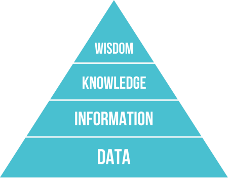

# La Pirámide de DIKW (Dato → Información → Conocimiento → Sabiduría)

- **Unidad / Tema:** Unidad 1 — Sistemas de Gestión de Bases de Datos. Conceptos de dato, información, conocimiento y sabiduría.
- **Semanas relacionadas:** Semana 1 (3 – 7 de Ago.)
- **Referencias del libro guía:** Connolly & Begg (6.ª ed.), Cap. 1 y 2. (Planeación, 4.ª ed. español: Cap. 1 y 2.)
- **Enlaces relacionados:** [Unidad 1 — README](README.md) · [Libro guía](../libro-guia-connolly-begg.md)

---

## ¿Qué es la pirámide de DIKW?

La **jerarquía DIKW** (del inglés *Data → Information → Knowledge → Wisdom*) es un
modelo que describe la relación entre datos, información, conocimiento y sabiduría,
y cómo los seres humanos (y las organizaciones) transforman los datos brutos en
conocimiento útil y decisiones acertadas.

Se representa como una pirámide porque cada nivel añade **valor, contexto y
complejidad** sobre el anterior: a medida que se asciende, se tiene menos volumen
pero mayor significado.

> **Nivel**   | **Significado**
> :---:       | :---
> D (Dato)    | Hecho en bruto, sin procesar y sin contexto.
> I (Información) | Dato procesado y organizado, con significado.
> K (Conocimiento) | Información interpretada, integrada con experiencia.
> W (Sabiduría) | Conocimiento aplicado para tomar buenas decisiones.